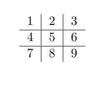

# TicTacToe

A simple interactive command line tic tac toe game built using java

### How to play?

1. To execute the jar file run the following command in the directory where you have saved the repo  
   `java -jar MyApp.jar`

2. Each empty grid is numbered from 1 to 9 going across and down.
    
   

3. Pick the position of the numbered tile and wait for the computer to end its turn.

4. Winner is the first to strike 3 consecutive tiles in a verticaly or horizontaly or diagonally accross the board.
